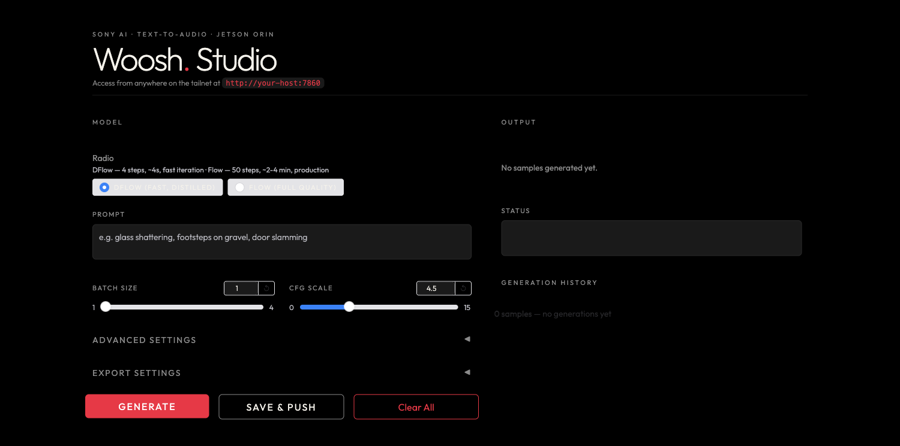

# Woosh Studio — Web UI

A web UI, REST API, and **MCP server** for [Sony Research's Woosh](https://github.com/SonyResearch/Woosh)
sound-effect foundation model, packaged for GPU-accelerated deployment on an **NVIDIA Jetson Orin**.

Type a prompt — `laser firing`, `glass shattering`, `thunderstorm rain` — and generate sound
effects with either the fast distilled **DFlow** model or the full-quality **Flow** model.



## Features

- **Two models** — DFlow (distilled, ~4 steps, sub-second on GPU) and Flow (full quality, adaptive ODE solver).
- **Batch generation** — up to 4 variations per prompt, shown as a thumbnail grid with inline
  players, filenames, sizes, and download links.
- **Export settings** — OGG / MP3 / WAV at a selectable sample rate (8–96 kHz) and bitrate; the
  download links are encoded to match.
- **Live progress** that tracks the sampler's steps (DFlow steps / Flow solver evaluations).
- **REST API** (Gradio) with copy-paste CLI / JavaScript / Python snippets in the UI.
- **MCP server** exposing a `generate_sound` tool for MCP clients (Claude Code, Claude Desktop, …).

## Running

The app runs as a `systemd --user` service (`woosh-ui.service`) that auto-starts on boot and
auto-restarts on failure:

```bash
systemctl --user status  woosh-ui.service
systemctl --user restart woosh-ui.service
journalctl --user -u woosh-ui.service -f
```

It serves on port **7860** — open `http://localhost:7860` (or `http://<host>:7860` from another
machine on your network, where `<host>` is the server's hostname or IP).

To run it manually instead:

```bash
uv run python woosh_ui.py --server-name 0.0.0.0 --server-port 7860
```

The Woosh model checkpoints are **not** included in this repo. Place them under `checkpoints/`
(`checkpoints/Woosh-DFlow`, `checkpoints/Woosh-Flow`) — see the upstream repo for download links.

## MCP

The MCP server (SSE transport) is exposed at `http://<host>:7860/gradio_api/mcp/sse` (replace
`<host>` with the server's hostname or IP).

Add it to an MCP client — e.g. Claude Code:

```bash
claude mcp add --transport sse woosh http://<host>:7860/gradio_api/mcp/sse
```

…or in `.mcp.json` / `claude_desktop_config.json`:

```json
{
  "mcpServers": {
    "woosh": {
      "type": "sse",
      "url": "http://<host>:7860/gradio_api/mcp/sse"
    }
  }
}
```

**Tool:** `generate_sound(prompt, model="DFlow", batch_size=1, cfg_scale=4.5, seed=-1,
output_format="ogg", sample_rate=48000, bitrate="256k")` → list of audio file URLs.

## GPU build (Jetson Orin)

This deployment targets **JetPack 6 / CUDA 12.6 / Python 3.10**. `torch`, `torchaudio`, and
`torchvision` are sourced from the [Jetson AI Lab](https://pypi.jetson-ai-lab.io) index (see
`pyproject.toml`), and `numpy` is pinned `<2` to match the Jetson torch ABI. `uv sync` reproduces
the CUDA-enabled environment:

```bash
uv sync
python -c "import torch; print(torch.__version__, torch.version.cuda, torch.cuda.is_available())"
# -> 2.8.0 12.6 True
```

## Credits

Built on [SonyResearch/Woosh](https://github.com/SonyResearch/Woosh) (Apache-2.0). Model weights
are © their respective authors and are not redistributed here.
